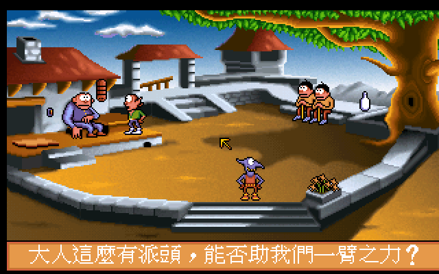
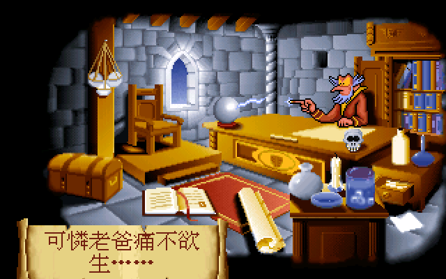

# 頑皮小精靈2　繁體中文化

*Gobliins 2: The Prince Buffoon — 1992 CD v2.01*

小丑王子被惡魔抓走了。這個惡魔叫**阿摩尼亞**——原文 Amoniak 在法文裡就是氨，
台灣人從小聞到大的那罐。Coktel 的惡趣味從反派的名字就開始，
而這款遊戲從頭到尾都是這個調調。

一代是三隻，二代改成兩隻：**芬格斯**一板一眼，負責動手做事；**溫可**是個活寶，
見什麼玩什麼，偏偏有些場面就是只有他那種玩法才打得開。兩隻同時在場、
一次只能操作一隻，解謎的核心是「先讓誰做什麼、再換誰接手」——
順序錯了，就看著兩隻小精靈把場面越弄越糟。

法師摩德姆斯把他們丟進村子的那一刻起，你大概會卡關、會被謎題的邏輯氣笑、
會對著螢幕問「這樣也行？」——1992 年的玩家就是這樣玩過來的，
只是他們看的是英文或法文。現在你看的是中文。

這個專案把遊戲裡的文字翻成繁體中文：劇情旁白、全部對白、道具與場景名稱、
遊戲內建的關卡提示，**六種原文語言（法／英／美／德／西／義）全部收進譯文表**，
所以不管你手上那份是哪個語言版本，跑起來都是中文。

交付形式是 ScummVM 引擎的 patch，**不含遊戲本體**。

<p align="center">
  
</p>

## 三十幾年前，雜誌上的一句話

一代上市時，《軟體世界》第 38 期的「遊戲獵人」專欄用了一個跨頁介紹它，
標題就是本專案沿用的譯名——「頑皮小精靈」。文章把三隻小精靈虧了一頓
（「各有各的專長（少得可憐的專長）」），稱讚 VGA 256 色的畫面「果然不是蓋的」，
還特別點名這系列最招牌的細節：你在操作其中一隻時，其他幾隻不會閒著，
會在旁邊玩溜溜球、吹泡泡。講到語言支援時，作者留下了這麼一句：

> 遊戲中支援五種語言，然而國內的玩家很可能大部份只用到英文的模式吧！
> 不過這也是一項不錯的設計（可惜沒有支援中文）。
>
> ——《軟體世界》第 38 期「遊戲獵人」，撰者 GEMINI

<p align="center">
  
</p>

他說可惜沒有支援中文。現在有了——[一代已經補上](https://github.com/wicanr2/gobliiins-1-cht)，
這個 repo 接著補二代。

至於**二代本身**當年在台灣的樣子，我們翻遍了老遊戲博物館的收錄清單與
《軟體世界》的掃描目錄，到目前為止一無所獲：找不到報導、找不到廣告，
甚至不能確定它當年有沒有被正式引進——1993 年的 CD-ROM 版在台灣本來就少見。
網路資料庫上流傳的「頑皮小精靈 2」沒有標注任何出處，比較像是從一代類推來的。
本專案沿用這個名字，理由是跟一代接軌，不是考據。

**如果你手上有 1992–93 年間任何提到這款遊戲的台灣雜誌、廣告或盒裝**，
請開個 issue 告訴我們——那會是這份文件目前最缺的一塊。

## 快速開始

1. 到 [Releases](../../releases) 下載你平台的 patch 包。
2. 準備好正版遊戲資料夾（要有 `intro.stk`、`gob2.lic`，CD 版另外需要 `track1.flac`）。
3. 把遊戲資料夾放在解開後的目錄旁邊、命名為 `game`，執行啟動腳本即可。
   也可以直接開啟動器自己 Add Game，中文資料會自動掛上。

**[重要] CD 音軌**：這一版的音樂是 CD 紅皮書音軌。少了它 ScummVM 會彈一個
阻擋式對話框，必須先處理掉才進得去。請從你的 `.cue`/`.bin` 轉出第一軌，
命名為 `track1.flac` 放進遊戲資料夾。

## 這一款的中文化難在哪

### 文字不在 TOT 裡

一代的文字放在 `.tot` 腳本檔內（`textsOffset` 指向表頭）。二代**整個搬出去了**：
`textsOffset == 0`，文字改放在同名的語言側檔，由 `Resources::getLocTextFile`
依語言挑檔。

| 副檔名 | 語言 | 則數 |
|---|---|---|
| `.dat` | **法**（原文） | 849 |
| `.ang` | 英／預設 | 797 |
| `.usa` | 美 | 774 |
| `.all` | 德 | 746 |
| `.esp` | 西 | 745 |
| `.ita` | 義 | 745 |

**`.dat` 是法文，不是「資料檔」。** 副檔名完全看不出來，第一次掃資源很容易把它
當無關檔案跳過——而它是最完整的那一份，也是這款遊戲的原文。

### v2 的文字流跟 v1 不是同一套

`Draw_v2::printTotText` 的控制碼比 v1 多很多，照 v1 的讀法會抽出一堆二進位垃圾。
最容易漏掉的是**框頭後面那段「線／框」指令**：每筆 9 bytes，直到 `uint16 == 0xFFFF`
為止再跳 2。漏掉這段就會把座標當字元讀，抽出的垃圾還會混進譯文表，實機永遠查不到。

抽字器（`tools/extract_gob2_texts.py`）與引擎端的 `Draw_v2::chtCollectTotText`
是**逐條對照寫的**。兩邊只要有一條不一致，key 就對不起來——靜態檢查全綠、
實機卻沒翻，是最難查的一種錯。

### 一句話只翻一次

抽出來是 2155 條不重複字串，但那其實是同樣的台詞被寫成六種語言。
逐條翻等於同一句話翻六次，而且六份譯文各自措辭，玩家切語言就看到不一樣的中文。

`tools/make_units.py` 依「TOT 檔名 + 項目索引」把六種語言併成一個**翻譯單元**，
再依英文內容併一次（片頭那段旁白裝在四個不同的 TOT 裡，只有靠內容才併得起來）。

```
2155 條字串 → 856 個單元（依 TOT+索引）→ 479 個單元（再依內容）
```

翻 479 句，攤回 2155 個 key。合併回去的時候順便跑機械檢查：缺號、空譯文、
超出框、非 Big5 字元、`%s` 不見了、簡體字與中國大陸用語。

### 譯文長度是硬約束，而且每個框不一樣大

訊息框是遊戲美術的一部分、大小改不了；中文字高是原字型的兩倍。
所以抽字時就把每個框能放幾個中文字算出來，直接寫進待翻檔：

```
### U0001  上限 14 字（每行 7 字 × 2 行）
英: AH! what a sad business...
法(原文): AH! TRISTE AFFAIRE EN VéRITé...
```

二代的框普遍很小：**上限中位數只有 19 個中文字**，最小的 12 字。
片頭那捲羊皮紙是 122×33 px，換算成中文是 7 字 × 2 行——原文有 26 個英文字元。

<p align="center">
  
</p>

引擎裡另外加了 `[CHTFIT]` 檢查，譯文多排一行就印出「需要幾行 vs 容得下幾行」，
翻譯照著壓字數，不靠肉眼判斷。實測全部譯文 0 溢出。

### 最底那條名稱列：跟原版一樣看不清楚，這是刻意的

畫面最底有一類 320×10 的框（`y=190`，八百多則，內容是場景物件名稱）。
10 px 高放不下 15 px 的中文字模。中間一度把中文往上推、順便擴大重繪範圍，
結果那條在中文版變成「看得見一半」，疊在對白列上像破圖。

**跑英文版對照後確認：原版英文在那條也幾乎看不見**（壓在橘色狀態列下緣）。
所以最後只做垂直夾制（字整個落在畫布內、不寫出界），重繪範圍維持原框——
可見程度與英文原版一致。這是刻意的，不是漏改。

## 防拷：有，但 ScummVM 已經幫你跳過了

二代有防拷，形式是**對照盒裝附的色卡**：畫面出現一個色塊，你要輸入對應的數字
（1 紅、2 黑、3 黃、4 綠、5 藍、6 白、7 灰、8 紫）。

ScummVM 預設會跳過這個畫面（`engines/gob/inter_v1.cpp`，`_copyProtection` 預設關閉），
所以沒有色卡也玩得下去。這幾則文字仍然翻了——想開 `copy_protection` 的人也看得懂。

一代的「關卡密碼」不是防拷，是取代存檔用的，兩者不要混。

## 建置

```bash
# 1. 取得 ScummVM 原始碼，切到 patch 對應的 commit
git clone https://github.com/scummvm/scummvm
cd scummvm && git checkout "$(cat ../patches/UPSTREAM_COMMIT.txt)"

# 2. 套用中文化 patch
git apply ../patches/0001-gob2-cht-big5.patch

# 3. 編譯（本專案一律走 docker）
./configure --enable-engine=gob --disable-all-engines --enable-flac
make -j"$(nproc)"
```

中文資料在 `dist-cht/`（`gob2_big5.fnt` 字型、`gob2_cht.tsv` 譯文表），
啟動時用 `--extrapath` 指過去即可，不必動遊戲資料夾。

**中文的開關是「字型檔存在」，不是 `--language`。**

## 目錄

| 路徑 | 內容 |
|---|---|
| `patches/` | ScummVM 引擎的中文化 patch ＋ 對應的上游 commit |
| `dist-cht/` | 中文資料：Big5 字型、譯文表、引擎指紋 |
| `translation/BRIEF.md` | 翻譯守則（風格、字數、用字紅線） |
| `translation/glossary.tsv` | 譯名基準表 |
| `translation/PUZZLES.md` | 遊戲內建的關卡提示，翻解謎句時的真相來源 |
| `translation/units.tsv`、`out/` | 翻譯單元與各批譯文 |
| `translation/converge.tsv` | 譯名收斂表（跨批漂移的統一入口） |
| `tools/` | 抽字、合併單元、烘字型、打包、驗收 |
| `.github/workflows/` | macOS universal `.app` 的 CI |

## 譯名

以當年《軟體世界》第 38 期介紹一代時用的「頑皮小精靈」為系列基準，
一代已確立的名字（安哥拉菲、尼亞克、夏德溫）沿用。

| 原文 | 中文 | 說明 |
|---|---|---|
| Fingus | 芬格斯 | 戴綠帽那隻，負責動手做事 |
| Winkle | 溫可 | 藍衣那隻，負責搞怪 |
| Amoniak | 阿摩尼亞 | 反派惡魔。原文是法文的「氨」，台灣日常就叫阿摩尼亞，雙關剛好對上 |
| Prince Buffoon | 小丑王子 | 被擄走的王子 |
| Tazaar | 塔薩爾 | 巫師 |
| Vivalzart | 維瓦札特 | 愛聽音樂又失眠的蒼鷺，原名是 Vivaldi＋Mozart |
| Schwarzy | 阿諾 | 肌肉守衛，原名玩 Schwarzenegger |
| Modemus | 摩德姆斯 | 把兩隻小精靈傳送過去的法師 |

完整清單見 [`translation/glossary.tsv`](translation/glossary.tsv)。

取名原則是**短**：最常見的訊息框只容得下 19 個中文字，名字每多一個字，
句子就少一個字可用。

## 驗證做到哪

- 實機跑過：翻譯查表 **0 MISS**、排版 **0 溢出**（`[CHTFIT]`）。
- Linux AppImage 與 Windows zip 都**從乾淨目錄實際啟動確認過**（Windows 走 wine），
  不是只看檔案存在。
- 六個包（3 平台 × patch／full）逐一比對包內中文資料的 md5 與引擎指紋，
  另外用 `dist-cht/` 的清單**反查缺件**——只走訪「包裡找到的檔案」會漏掉
  「新增了一種資料但打包腳本忘了加」這種最慘的情況。
- **macOS 尚未在真 Mac 上啟動過**：`.app` 在 Linux 上既不能簽章也不能執行。
  跑過「修復-macOS.command」後如果有問題，請開 issue。

## 相關專案

- [頑皮小精靈（一代）繁體中文化](https://github.com/wicanr2/gobliiins-1-cht)
- [頑皮小精靈3 繁體中文化](https://github.com/wicanr2/goblins-3-cht)

## 授權與權利

- 本專案只散布 ScummVM 引擎的修改（GPLv3）與自製的中文資料。
- **不散布任何遊戲資源。** 遊戲版權屬於 Coktel Vision / M.D.O. 及其權利繼受人。
- 倚天中文系統點陣字型的權利屬於原權利人；本專案只從譯文用到的字集烘出子集。
